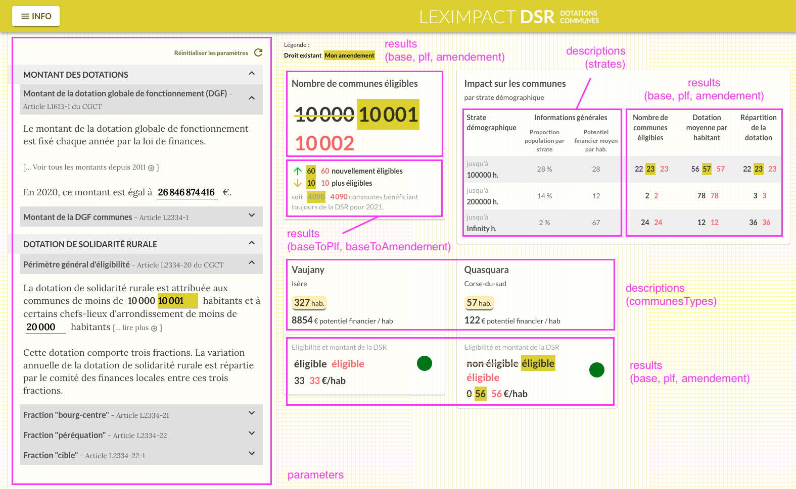

# Introduction

## [FR] Introduction

Ceci est le code source de l'interface utilisateur de LexImpact.

LexImpact permet aux administrations, aux parlementaires et à la société civile de simuler l'impact _ex ante_ des réformes au système socio-fiscal.
* [Appels à candidatures](https://entrepreneur-interet-general.etalab.gouv.fr/defis/2019/leximpact.html)
* [Fiche produit](https://beta.gouv.fr/startups/leximpact.html)
* [LexImpact](https://leximpact.an.fr)

LexImpact est constitué de deux parties :

- [leximpact-server](https://github.com/betagouv/leximpact-server/) : application en python utilisant [OpenFisca-France](https://github.com/openfisca/openfisca-france) permettant de mettre en place une API Web répondant à des questions sur l'impact de modifications de la loi fiscale,
- Ici même, [leximpact-client](https://github.com/betagouv/leximpact-client/) : interface web communiquant avec l'API qui met à disposition des usagers un site web permettant de définir des modifications de la loi et d'en visulaliser les résultats calculés par l'API.


## [EN] Introduction

This is the source code of LexImpact user interface.

LexImpact allows civil servants, policy makers and citizens to simulate the _ex ante_ impact of a reform to a country's tax-benefit system.
* [Call for candidates (FR)](https://entrepreneur-interet-general.etalab.gouv.fr/defis/2019/leximpact.html)
* [Elevator pitch (FR)](https://beta.gouv.fr/startups/leximpact.html)
* [LexImpact](https://leximpact.an.fr)

LexImpact has two components:

- [leximpact-server](https://github.com/betagouv/leximpact-server/): a Python application using [OpenFisca-France](https://github.com/openfisca/openfisca-france) and providing a Web API responding to requests on the impact of a change of the tax law,
- Here, [leximpact-client](https://github.com/betagouv/leximpact-client/): a web interface interacting with leximpact-server API and providing to the users a web site to set law tax changes and see the results calculated by the API.

## Organisation de l'état de l'application



L'état redux est en cours de re-factorisation. Voici la manière dont il se présentera à terme:

```bash
- parameters # Paramètres de loi modifiables (panneau latéral de gauche)
  - amendement # Valeurs modifiées par l'utilisateur
    - ir
    - dotations
  - base # Valeurs présentes dans le code en vigueur
    - ir
    - dotations
  - plf # Valeurs proposées par le Projet de Loi des Finances
    - ir
    - dotations
  - interfaces # Descriptions des états (identiques dans amendement, base et plf)
    - ir
    - dotations
- results # Résultats de la simulation
  - amendement # Résultats correspondant aux valeurs modifiées par l'utilisateur
    - ir
    - dotations
  - base # Résultats correspondant aux valeurs du code en vigueur
    - ir
    - dotations
  - plf # Résultats correspondant aux valeurs proposées par le Projet de Loi des Finances
    - ir
    - dotations
  - baseToPlf # Résultats comparant le PLF avec le code existant
    - ir
    - dotations
  - baseToAmendement  # Résultats comparant les valeurs proposées par l'utilisateur avec le code existant
    - ir
    - dotations
  - interfaces # Descriptions des états (identiques dans amendement, base et plf)
    - ir
    - dotations
- descriptions # Autres paramètres de la simulation qui ne sont pas des paramètres de la loi.
  - ir
    - casTypes
  - dotations
    - communesTypes
- auth # Elements d'authentification
- display # Element d'affichage (l'affichage d'un message d'information est géré dans cette section)
  - ir
  - dotations
```

Les données asynchrones (comme les résultats de la simulation) sont décrites par cette interface:

```typescript
export interface AsyncState<T> {
  isFetching: boolean;
  state: T | null;
}
```

## Organisation des composants

```bash
- common # Composants communs à toutes les pages
- dotations # Composants spécifiques à la page dotations
  - common # Composants communs à plusieurs parties de la page
  - articles # Section paramètres à gauche
  - results # Resultats à droite
    - common
    - ...
- ir # Composants spécifiques à la page ir
- ... # Composants spécifiques à la page ...
```

## Ajouter d'un composant avec un état

```typescript
interface Props {

}

const mapStateToProps = (state: RootState) => ({
  // ...
});

const mapDispatchToProps = (dispatch, { name }: Props) => ({
  // ...
});

const connector = connect(mapStateToProps, mapDispatchToProps);

type PropsFromRedux = ConnectedProps<typeof connector>;

class Foobar extends PureComponent<PropsFromRedux & Props> {
  // ...
}

const Component = connector(Foobar);

export { Component as Foobar };

```

## How to use

To install and launch the client in developer mode, run the following commands:

```shell
npm install
npm run dev
```

## Configuration file `.env`

A file name `.env` is necessary for the client to work properly. The file `.env.example` can be copied into it.

Here ate the environment variables that you have to set:
- `API_URL`: leximpact-client is just a web interface that does not do computations by itself, but needs to be provided a working [leximpact-server](https://github.com/betagouv/leximpact-server/) Web API to fetch results. As of v`1.0.0`, a working API example can be found on: https://api.leximpact.an.fr
- `PORT`: describes the port that the client will be setup to (e.g. the website will be accessible from http://127.0.0.1:<PORT> if the client is run locally). If ommited, defaults to `9001`

# Affichage du PLF

L'affichage du PLF est contrôlé par l'état redux `parameters.plf` et par l'état `results.casTypes`.

- Pour afficher les valeurs des paramètres, vous devez définir la variable `PLF_DEFAULT_STATE` comme valeur par défaut de l'état dans `parameters/plf.ts`.
- Pour afficher les résultats, la réponse de l'API doit inclure une propriété `plf` (voir documentation côté serveur).

# Snapshot testing with Jest

Snapshot tests are a very useful tool whenever you want to make sure your UI does not change unexpectedly.

> A typical snapshot test case for a mobile app renders a UI component, takes a snapshot, then compares it to a reference snapshot file stored alongside the test. The test will fail if the two snapshots do not match: either the change is unexpected, or the reference snapshot needs to be updated to the new version of the UI component.


For more information, please see the Jest [official documentation](https://jestjs.io/docs/en/snapshot-testing).

Here is the command to run these tests:

```shell
npm run test
```

To update the reference snapshots, run:

```shell
npm run test --updateSnapshots
```

This is similar to: `./node_modules/.bin/jest --updateSnapshots`

# Screenshot


# Icons & Emoji sources

- [Twitter Emoji](https://iconify.design/icon-sets/twemoji/)
- [MaterialUI Icons](https://material.io/resources/icons)

# Documentation

- [MaterialUI v3.9.9 Documentation](https://v3.material-ui.com/getting-started/installation/)
